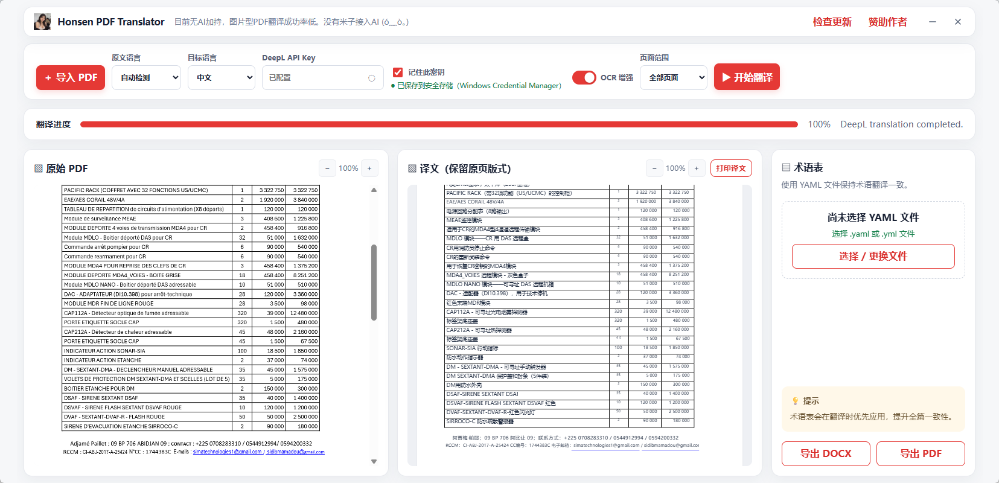

# Honsen Document Translator

面向 Windows 的文档翻译桌面应用。支持 PDF、Word（.doc/.docx）、PowerPoint（.ppt/.pptx）、Excel（.xls/.xlsx）、TXT 和 Markdown 的 DeepL 翻译。

- Word 保留段落、表格、页眉和页脚结构；PowerPoint 翻译幻灯片与备注文字；Excel 只翻译普通文本单元格，不修改公式或合并单元格。
- Office 文件在预览时临时转为 PDF；TXT 和 Markdown 直接预览。Markdown 保留代码块、行内代码、链接 URL 和图片路径，并翻译图片 alt 文本。

DOCX 导出会嵌入已完成的译文页面图像，保证与应用预览一致；页内文字不可直接编辑。需要可编辑内容时，请使用译文预览中可编辑的文本后再导出 PDF。

## 界面示例



## 配置

复制 `.env.example` 为 `.env`，填写 DeepL API Key：

```text
DEEPL_API_KEY=your-key
```

渲染界面不会读取该文件或把密钥发送给 JavaScript；Tauri 后端仅在发起翻译请求时读取密钥，并通过 HTTPS 调用 DeepL。也可在应用界面中保存密钥至 Windows 凭据管理器。

## OCR 与扫描件

扫描型 PDF 使用本地 Poppler 渲染和 Tesseract OCR，不会把文档上传到 OCR 云服务。应用打包 Poppler、Tesseract、21 种语言包及方向/脚本检测数据。

没有文字层的页面会自动进入 OCR。含可选中文本、图片、签名或印章的混合页面默认保留原有图片内容，避免把印章和图片误识别为文字。详细策略见 [OCR 说明](docs/OCR.md)。

## 更新与便携版

界面右上角可检查 GitHub Releases 中的新版、查看更新说明，并在确认后下载、校验 SHA-256、静默安装。不会自动下载或安装更新。

`pnpm tauri:portable` 会把 LibreOffice 与精简 Python 标准库运行时一并打包；最终用户无需安装 Python、Microsoft Office 或 LibreOffice。发布前运行 `pnpm stage:runtimes`。运行时目录会被 Git 忽略。

## 第三方运行库与许可证

本软件包包含以下本地运行库，用于内部使用：

- [Tesseract OCR](https://github.com/tesseract-ocr/tesseract)：Apache-2.0；其随附依赖的许可与归属见上游发行物。
- [tessdata_fast](https://github.com/tesseract-ocr/tessdata_fast) 语言数据：Apache-2.0。
- [Poppler](https://poppler.freedesktop.org/)：包含 GPL 组件；本项目仅在内部环境分发和使用，外部再分发前必须确认 Windows 构建来源、完整许可证与源码提供义务。
- LibreOffice：随其运行时附带 `LICENSE.html`、`license.txt` 与 `NOTICE`。
- Python：Python Software Foundation License；仅包含文档翻译所需的解释器、DLL 和标准库，不包含第三方 Python 包。

安装包当前未进行 Authenticode 代码签名，Windows 可能显示未知发布者或 SmartScreen 提示；内部部署前请自行核验 GitHub Release 附带的 SHA-256。

## 开发与验证

```powershell
pnpm install
pnpm test
pnpm typecheck
pnpm lint
pnpm b
pnpm stage:runtimes
pnpm tauri dev
```

本地处理与 DeepL 数据流见 [隐私说明](docs/PRIVACY.md)。Office 文件行为见 [格式说明](docs/V2_DOCUMENT_FORMATS.md)。发布审计与剩余检查项见 `docs/PRODUCTION_AUDIT.md`、`docs/RELEASE_CHECKLIST.md`。
